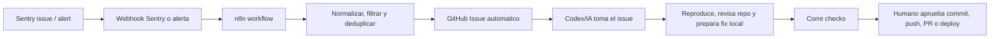

# Flujo de monitoreo y reparacion asistida

Este runbook convierte errores reales de produccion en trabajo trazable sin dar permisos amplios ni automatizar cambios peligrosos.

## Estado actual

- App: Next.js 16.2.6, React 19, Prisma 7, Supabase Auth, Tailwind 4, Vitest 4.
- Hosting: Vercel.
- Base de datos: Supabase.
- Monitoreo: Sentry, PostHog y logs de Vercel.
- Automatizaciones: n8n self-hosted.
- Repo: GitHub.
- CI: `.github/workflows/ci.yml` ejecuta lint, typecheck, tests, build, audit y E2E cuando hay variables.
- Docs relacionadas: `docs/SENTRY.md`, `docs/SENTRY_AUTOFIX_RUNBOOK.md`, `docs/N8N-SETUP.md`, `docs/ORCHESTRATOR.md`.

No hay un flujo automatico confirmado en este repo que tome un error de Sentry y cree un GitHub Issue normalizado. Este documento define ese flujo.

## Flujo recomendado



El camino recomendado es Sentry -> n8n -> GitHub Issue. Sentry tambien puede integrarse directo con GitHub, pero esa integracion pide permisos mas amplios que el token minimo para solo crear issues. Para GestiOS, n8n permite filtrar ruido y usar un token fine-grained con alcance limitado.

## Permisos minimos

GitHub token fine-grained:

- Resource owner: cuenta u organizacion donde vive el repo.
- Repository access: solo el repo de GestiOS.
- Repository permissions:
  - Metadata: Read.
  - Issues: Read and write.
- No dar Contents, Actions, Secrets, Deployments, Administration, Workflows ni Pull Requests para este flujo.

Con esos permisos n8n puede listar issues abiertos para deduplicar y crear/comentar issues. No puede modificar codigo ni abrir PRs. Eso es intencional: el fix queda en manos del agente local y requiere aprobacion humana.

## Variables y secretos

En Vercel/app, mantener las variables actuales de Sentry:

```env
NEXT_PUBLIC_SENTRY_DSN=
SENTRY_ORG=
SENTRY_PROJECT=
SENTRY_AUTH_TOKEN=
```

En n8n, guardar como credenciales o variables del servidor n8n, no en el repo:

```env
GITHUB_ISSUES_TOKEN=
GITHUB_OWNER=
GITHUB_REPO=
SENTRY_WEBHOOK_CLIENT_SECRET=
```

Notas:

- `GITHUB_ISSUES_TOKEN` debe vivir en credenciales de n8n siempre que sea posible.
- `SENTRY_WEBHOOK_CLIENT_SECRET` se usa para validar la firma `Sentry-Hook-Signature` si el flujo usa Sentry webhooks.
- No pegar tokens en GitHub Issues, logs, README, Sentry breadcrumbs ni respuestas del agente.
- Si un secreto aparece en un issue, cerrar el issue publico, rotar el secreto y crear un issue limpio.

## Configurar Sentry

1. Confirmar que produccion tiene:
   - `NEXT_PUBLIC_SENTRY_DSN`.
   - `SENTRY_ORG`.
   - `SENTRY_PROJECT`.
   - `SENTRY_AUTH_TOKEN` para upload de sourcemaps en build.
2. En Sentry, entrar al proyecto de GestiOS.
3. Crear o ajustar alertas de issues:
   - Nuevo issue en `environment=production`.
   - Regression en `environment=production`.
   - Frecuencia alta, por ejemplo 10 eventos en 1 hora.
   - Nivel `error` o `fatal`.
4. Accion recomendada:
   - Enviar webhook a n8n.
   - Mantener email como respaldo humano.
5. Si se usa la integracion directa Sentry GitHub:
   - Limitarla al repo de GestiOS.
   - Usarla solo si el equipo acepta los permisos adicionales que pide Sentry.
   - Aun asi, mantener n8n para normalizacion si el ruido crece.
6. Verificar que Sentry no envie PII innecesaria:
   - No incluir cookies, tokens, Authorization headers ni service role keys.
   - Revisar data scrubbing en Sentry antes de activar el flujo en produccion.

## Configurar n8n

Crear workflow: `WF-GS-ERR-01: Sentry to GitHub Issue Draft`.

### Estado real en n8n

Creado como draft no publicado el 2026-06-03 y organizado por prefijo el 2026-06-04:

- Workflow: `WF-GS-ERR-01: Sentry to GitHub Issue Draft`.
- ID: `H1PDrinGPYtBcyhw`.
- URL: `https://n8n-sergio-n8n.hqdqgh.easypanel.host/workflow/H1PDrinGPYtBcyhw`.
- Estado: inactivo, no publicado.
- Proyecto: personal `On IA <oninteligenciaartificial@gmail.com>`.
- Carpeta recomendada: `Gesti-os`.
- Nodos actuales:
  - `Sentry production webhook`.
  - `Build GitHub issue payload`.
  - `Create GitHub issue`.
- Ruta test: `/webhook-test/gestios/sentry-production-error`.
- Ruta produccion: `/webhook/gestios/sentry-production-error`.
- Prueba MCP simulada: execution `8394`, status `success`.

Este draft todavia no esta publicado. El nodo `Create GitHub issue` ya existe y apunta a `POST https://api.github.com/repos/oninteligenciaartificial/Gestios/issues`, pero el MCP de n8n no pudo adjuntar automaticamente la credencial al nodo `HTTP Request`.

Organizacion aplicada:

- El workflow draft nuevo quedo con prefijo `WF-GS-ERR-01` para agruparlo con los flujos de errores de GestiOS.
- El MCP disponible permite buscar proyectos, carpetas y workflows, y actualizar metadata del workflow.
- El MCP disponible no expuso una operacion segura para mover workflows entre carpetas. Si se quiere moverlo visualmente, hacerlo desde la UI de n8n a la carpeta `Gesti-os`.
- Existe otro workflow llamado `WF-SENTRY-01 - Sentry Codex Triage`, pero no pudo organizarse por MCP porque n8n respondio `Workflow is not available in MCP`. Para editarlo por MCP, activar MCP access desde la tarjeta del workflow o desde sus settings.

Credencial Bearer detectada:

- Nombre actual: `Bearer Auth account`.
- ID: `m7UmZOpSnXOuGNTn`.
- Tipo: `httpBearerAuth`.

Paso manual pendiente en n8n:

1. Abrir el workflow `WF-GS-ERR-01: Sentry to GitHub Issue Draft`.
2. Abrir el nodo `Create GitHub issue`.
3. En `Authentication`, seleccionar `Generic Credential Type` o equivalente.
4. En `Generic Auth Type`, seleccionar `Bearer Auth`.
5. En credencial, seleccionar `Bearer Auth account`.
6. Guardar el workflow.

Despues de ese paso, probar antes de publicar.

### Crear la credencial GitHub en n8n

En n8n, las credenciales salen desde el proyecto:

1. Entrar a `Personal` o al proyecto donde esta el workflow.
2. Abrir la pestana `Credentials`.
3. Click en `Create credential`.
4. Buscar y elegir `Bearer Auth`.
5. Completar los campos asi:

| Campo n8n | Valor |
|---|---|
| `Token` o `Bearer Token` | `<GITHUB_FINE_GRAINED_TOKEN>` sin la palabra `Bearer` |
| `Allowed HTTP Request Domains` | `api.github.com` si n8n permite restringirlo; si no, dejar `All` solo temporalmente |

Despues, en `Details`, renombrar la credencial a:

```txt
GitHub Issues - GestiOS
```

Notas importantes:

- Para GitHub, `Bearer Auth` es la credencial preferida en `HTTP Request`. El propio node type de n8n recomienda `httpBearerAuth` para `Authorization: Bearer <token>`.
- No escribir la palabra `Bearer` dentro del token si usas `Bearer Auth`; n8n agrega el header `Authorization: Bearer ...`.
- `Header Auth` tambien puede verse en la UI, con `Name=Authorization` y `Value=Bearer <token>`, pero el MCP de n8n no pudo adjuntarla al nodo `HTTP Request` automaticamente en este workflow.
- No pegar el token en docs, GitHub Issues, chats, logs ni codigo.
- El token debe ser fine-grained, limitado al repo `oninteligenciaartificial/Gestios`, con solo `Metadata: Read` e `Issues: Read and write`.
- Si `Allowed HTTP Request Domains` permite elegir dominio, usar `api.github.com` para que esa credencial no pueda usarse contra otros servicios.

### 1. Webhook Trigger

- Node: Webhook.
- Method: `POST`.
- Path: `gestios/sentry-production-error` o un path aleatorio estable.
- Auth: Header auth o Basic auth si no se valida firma Sentry en un Code node.
- Respond: immediately con `200`.
- Usar URL de test durante pruebas y URL de produccion solo despues de activar el workflow.

### 2. Validacion de origen

Agregar Code node:

- Validar `Sentry-Hook-Signature` con `SENTRY_WEBHOOK_CLIENT_SECRET` si el payload viene de Sentry Integration Platform.
- Rechazar si falta firma cuando el workflow requiere firma.
- No escribir body completo en logs.
- Eliminar campos sensibles antes de continuar.

### 3. Filtro de ruido

Agregar IF node:

- Continuar solo si `environment == "production"`.
- Continuar solo si nivel es `error` o `fatal`.
- Priorizar `created`, `regressed` o frecuencia alta.
- Ignorar `localhost`, preview sin datos reales o errores ya resueltos.

### 4. Deduplicacion

Antes de crear issue:

1. Extraer `sentry_issue_id` o URL canonica del issue.
2. Buscar issues abiertos en GitHub con labels `sentry` y `production`.
3. Si ya existe un issue con el mismo `sentry_issue_id`, agregar comentario con el nuevo evento y no crear duplicado.
4. Si no existe, crear issue nuevo.

### 5. Crear GitHub Issue

Node: GitHub -> Issue -> Create, o HTTP Request a GitHub REST.

Titulo sugerido:

```txt
[Sentry][P1] <exception type> en <route o transaction>
```

Labels sugeridos:

```txt
sentry, production, needs-triage
```

Precrear esas labels en GitHub. Si no existen y el token no puede crearlas, omitir labels en n8n hasta crearlas manualmente.

Body minimo:

```md
## Sentry

- Issue: <url>
- Issue ID: <id>
- Environment: production
- Release: <release>
- Level: <error|fatal>
- Events/users: <count>

## Contexto tecnico

- Route/transaction:
- Runtime:
- Stacktrace relevante:
- Breadcrumbs/replay:
- Tags utiles:

## Redaccion

- [ ] No contiene tokens, cookies, Authorization headers ni service role keys.
- [ ] No contiene PII innecesaria.

## Instruccion para Codex

Seguir AGENTS.md y docs/ORCHESTRATOR.md. Reproducir, corregir localmente, agregar test de regresion cuando aplique, ejecutar checks y esperar aprobacion humana antes de commit, push, PR o deploy.
```

## Prueba extremo a extremo

Con credenciales disponibles:

1. Crear token fine-grained de GitHub con permisos minimos.
2. Guardarlo en credenciales de n8n.
3. Activar modo test del Webhook node.
4. Enviar payload de prueba desde Sentry si la UI lo permite, o usar un payload JSON falso sin secretos.
5. Confirmar que n8n recibe el evento.
6. Confirmar que el filtro acepta solo `production`.
7. Confirmar que GitHub crea un issue con body redactado.
8. Reenviar el mismo `sentry_issue_id`.
9. Confirmar que n8n comenta el issue existente y no duplica.
10. Pegar la URL del issue a Codex para ejecutar el flujo de reparacion.

Sin credenciales disponibles:

- No marcar E2E como verde.
- Validar docs, plantilla, variables y formato.
- Ejecutar el dry-run local:

```bash
npm run check:monitoring-flow
```

- Si se quiere validar firma con un payload real de Sentry, guardar la firma recibida como variable local temporal y ejecutar:

```bash
SENTRY_WEBHOOK_CLIENT_SECRET=<secret> SENTRY_WEBHOOK_SIGNATURE=<firma> npm run check:monitoring-flow -- --verify-signature --sample <payload.json>
```

En PowerShell:

```powershell
$env:SENTRY_WEBHOOK_CLIENT_SECRET="<secret>"
$env:SENTRY_WEBHOOK_SIGNATURE="<firma>"
npm run check:monitoring-flow -- --verify-signature --sample <payload.json>
Remove-Item Env:SENTRY_WEBHOOK_CLIENT_SECRET
Remove-Item Env:SENTRY_WEBHOOK_SIGNATURE
```

- Registrar que la prueba real queda como gate externo.

## Que hace Codex cuando llega un issue real

1. Leer `AGENTS.md`, `docs/ORCHESTRATOR.md`, `docs/SKILLS_ROUTING.md` y este runbook.
2. Leer el GitHub Issue y abrir la URL de Sentry solo si hay acceso.
3. Clasificar severidad:
   - P0: caida, perdida de datos, fuga de datos, checkout/POS/auth/billing roto.
   - P1: error frecuente o flujo principal afectado.
   - P2: error aislado, copy, edge case o deuda sin impacto inmediato.
4. Reproducir localmente o con test minimo.
5. Revisar stacktrace, archivos tocados, rutas API, queries y tenant scope.
6. Preparar fix acotado.
7. Agregar test de regresion cuando aplique.
8. Ejecutar checks relevantes:
   - `npm run lint`
   - `npx tsc --noEmit`
   - `npm test`
   - `npm run build`
   - `npm run test:e2e` si toca flujo critico y hay datos.
9. Resumir causa, fix, checks, riesgos y pedir aprobacion antes de commit, push, PR o deploy.

## Computadora apagada vs agente local

Funciona con la computadora apagada si:

- Sentry esta en la nube.
- n8n esta publicado en un servidor encendido, por ejemplo Easypanel/VPS/n8n Cloud.
- GitHub esta accesible.

No funciona con la computadora apagada si:

- n8n corre en la PC local.
- El paso esperado es que Codex local lea el issue y modifique archivos.
- Los checks dependen del workspace local.

En ese caso, el error igual puede quedar registrado en Sentry, pero la reparacion asistida empieza cuando el agente local vuelve a estar encendido y recibe el issue.

## Riesgos restantes

- Mitigado localmente: `npm run check:monitoring-flow` valida el payload demo, redaccion basica y formato del issue sin usar servicios externos.
- Pendiente real: falta configurar y probar credenciales reales de n8n/GitHub/Sentry.
- Pendiente real: falta ejecutar `npm run check:monitoring-flow -- --verify-signature --sample <payload.json>` con payload y firma reales de Sentry.
- La integracion directa Sentry GitHub puede pedir permisos mas amplios que el flujo n8n recomendado.
- GitHub Issues puede contener PII si Sentry no esta bien redactado.
- El token minimo no puede crear PRs ni modificar codigo; eso es una restriccion de seguridad deliberada.
- Los fixes automaticos sin revision humana no estan permitidos para produccion.
- Si el error depende de datos reales de Supabase, puede requerir acceso controlado o datos anonimizados para reproducir.

## Fuentes oficiales consultadas

- Sentry Webhooks: https://docs.sentry.io/organization/integrations/integration-platform/webhooks/
- Sentry GitHub integration: https://docs.sentry.io/organization/integrations/source-code-mgmt/github/
- Sentry Issue Alert API: https://docs.sentry.io/api/alerts/create-an-issue-alert-rule-for-a-project/
- n8n Webhook node: https://docs.n8n.io/integrations/builtin/core-nodes/n8n-nodes-base.webhook/
- n8n GitHub node: https://docs.n8n.io/integrations/builtin/app-nodes/n8n-nodes-base.github/
- GitHub REST Issues API: https://docs.github.com/en/rest/issues/issues#create-an-issue
- GitHub fine-grained token permissions: https://docs.github.com/en/rest/authentication/permissions-required-for-fine-grained-personal-access-tokens
